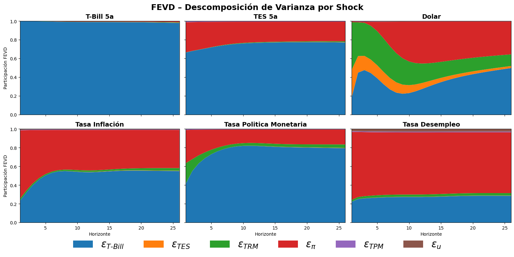

# Bayesian Structural VAR (SBVAR) with Local Projections (LP)


---

A self-contained research framework that estimates a **Bayesian Structural VAR (SBVAR)** with **agnostic identification**, and complements it with **Local Projections (LP)** to assess the robustness of impulse-response dynamics under alternative identification strategies.

This project aims to isolate **U.S. monetary policy shocks** and evaluate their transmission to **Colombian macro-financial variables** such as interest rates, inflation, exchange rate, and unemployment.

---

## 🔹 Model Overview

### **1. Structural Bayesian VAR (SBVAR)**

Implements a Bayesian structural model of the form:

$$
A_0 y_t = a_0 + \sum_{i=1}^p A_i y_{t-i} + C \varepsilon_t
$$

- **Priors:**

  - Conjugate Minnesota-type priors for reduced-form parameters $(B, \Sigma)$
  - Soft priors (truncated or skewed-t) for structural coefficients $A_0$ and shock loadings $C$

- **Sampling:**

  - Gibbs sampling for $B$ and $\Sigma$
  - Metropolis–Hastings for $A_0$ and $C$ with adaptive scaling during warm-up

- **Diagnostics:**

  - Convergence analysis via R-hat, rolling means, and ESS
  - Posterior trace plots and acceptance-rate monitoring

- **Outputs:**
  - Posterior draws of $A_0$, $B$, and structural shocks
  - IRFs with 68% and 80% credible intervals
  - FEVDs (Forecast Error Variance Decomposition)

---

### **2. Local Projections (LP – Jordà, 2005)**

Implements two complementary LP methodologies for robustness verification of the SBVAR IRFs:

| Method           | Description                                                                                                         | Folder                               |
| :--------------- | :------------------------------------------------------------------------------------------------------------------ | :----------------------------------- |
| **LP–Posterior** | Runs LP regressions for each posterior draw of the SBVAR, computing percentile-based IRF bands across draws.        | `src/local_projections_posterior.py` |
| **LP–HAC**       | Estimates a single LP with HAC-robust standard errors, using the structural shock from a representative SBVAR draw. | `src/local_projections_HAC.py`       |

Both methods replicate the dynamic responses to U.S. T-bill shocks and allow validation of the **shape, timing, and sign consistency** of the structural IRFs.

### **3. MCMC Sampling and Posterior Filtering**

The MCMC routine integrates a **diagnostic-based chain trimming** procedure that ensures the validity of posterior draws used in inference.

- **Two-chain sampling:** Each MCMC run generates two independent chains with controlled seeds for convergence assessment.
- **Diagnostics-based selection:** Posterior samples are filtered using rolling diagnostics:
  - **Rank R-hat** (Gelman–Rubin diagnostic) computed over sliding windows.
  - **Cumulative mean stability** test to ensure posterior stationarity.
  - Optional **validity filters** (e.g., positive definiteness, invertibility) applied to each draw before diagnostics.
- **Adaptive trimming logic:**  
  The algorithm selects valid posterior segments through two complementary modes:
  - **Global cut (`t*`)** — a single conservative burn-in cutoff based on both R-hat and mean stability.
  - **Per-parameter contiguous blocks** — identifies stable intervals (`segment_draws`) for each parameter where chains exhibit convergence and low variance drift.
- **Output validation:** Only stable and converged posterior segments are used for inference, ensuring that IRFs, FEVDs, and LP regressions are computed from **diagnostically consistent samples**.

This filtering scheme acts as an **automated posterior refinement step**, minimizing the inclusion of non-stationary or pre-convergence draws and improving the credibility of structural inference.

---

## 📊 Analytical Outputs

- **IRFs (Impulse Response Functions)**  
  Median responses with 68% and 80% credible or confidence bands.
  <p align="center">
  
  </p>


- **Local Projections – HAC**
  <p align="center">
  
  </p>

- **FEVD (Forecast Error Variance Decomposition)**
  <p align="center">
  
  </p>

- **Markov Chain Trimming**
  <p align="center">
  
  </p>

---

## 🧩 Repository Structure

```plaintext
SBVAR/
│
├── experiments/ # Figures and visual outputs
│
├── src/ # Modular source code
│ ├── identification.py # Structural identification priors and A0 routines
│ ├── irfs_fevd.py # IRF and FEVD construction from posterior draws
│ ├── local_projections_HAC.py # LP via HAC standard errors
│ ├── local_projections_posterior.py # LP via posterior draws
│ ├── lp_utils.py # Lag construction and alignment helpers
│ ├── mcmc_advanced.py # MCMC tuning and diagnostics
│ ├── metropolis_sampler.py # Metropolis–Hastings routines
│ ├── posteriors_gibbs.py # Gibbs sampling for B, Σ
│ └── graph_analisis.py # Visualization utilities
│
├── sbar_showcase/
│ └── Bayesian_SVAR_LP.ipynb # Main notebook: SBVAR + LP integration
│
└── Bayesian_SVAR_LP.ipynb # All Functions in one Jupyter
└── XARIMA13_seasonal_fit # R script for XARIMA13 seasonal

```

## Dependencies

```bash
pip install pandas numpy scipy numdifftools matplotlib seaborn arviz xarray ontextlib
```

## 🧠 Research Contribution

- Extends standard SBVAR frameworks by integrating **Bayesian inference** with **Local Projections** for cross-method consistency analysis.
- Provides a **modular and reproducible codebase** for structural identification, posterior simulation, and IRF validation.
- Enables **robustness verification** of structural dynamics under both Bayesian and frequentist perspectives.

References:

**J. Jacobo, Una introducción a los métodos de máxima entropía y de inferencia bayesiana en econometría**

## Contributing

Contributions are welcome! Please open issues or submit pull requests at  
https://github.com/pablo-reyes8

## License

This project is licensed under the Apache License 2.0.
